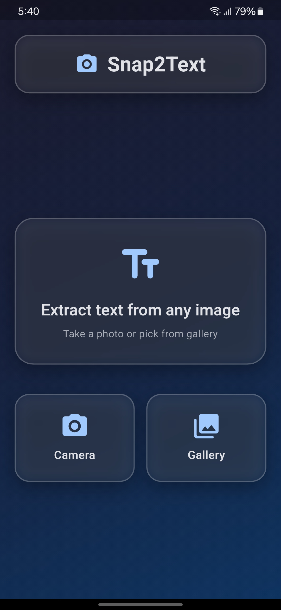
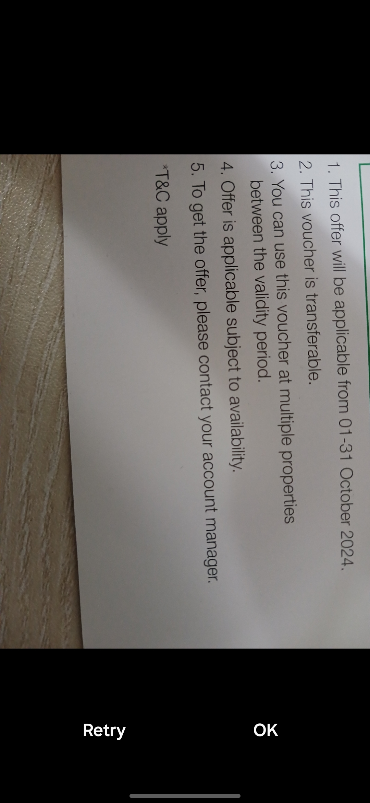
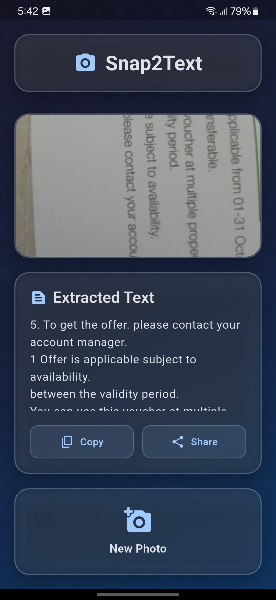

# 📸 Snap2Text – Instant Text Extractor

 

> Extract text from images instantly with your phone's camera or gallery. Perfect for digitizing notes, receipts, signs, and more!

## ✨ Features

### Core Functionality
- 📷 **Image Capture**: Use camera or pick from gallery
- 🔍 **OCR Magic**: Powered by ML Kit for accurate text recognition
- 📋 **Text Actions**: Copy, share, or save extracted text with one tap

### Bonus Goodies
- ✏️ **Text Editing**: Clean up OCR results before saving
- 🌙 **Dark/Light Mode**: Eye-friendly themes
- 🚀 **Smooth Animations**: Delightful UI interactions
- 🕶️ **Glassmorphic UI**: Sleek modern design

## 🛠️ Tech Stack

### Flutter Plugins
| Plugin | Purpose |
|--------|---------|
| `google_mlkit_text_recognition` | OCR text extraction |
| `image_picker` | Camera/gallery access |
| `share_plus` | Sharing extracted text |
| `flutter_riverpod` | State management |
| `glassmorphism_ui` | Visual effects (optional) |

## 🚀 Getting Started

### Prerequisites
- Flutter SDK (latest stable)
- Android/iOS development environment

### Installation
1. Clone the repo:
   ```bash
   git clone https://github.com/theprantadutta/snap2text.git
   ```
2. Install dependencies:
   ```bash
   flutter pub get
   ```
3. Run the app:
   ```bash
   flutter run
   ```

## 📸 Screenshots

| Capture Screen | Results Screen | Home Screen |
|---------------|---------------|-----------|
|  |  |  |

## 🤝 Contributing
Pull requests welcome! For major changes, please open an issue first.

## 📜 License
[MIT](https://choosealicense.com/licenses/mit/)
